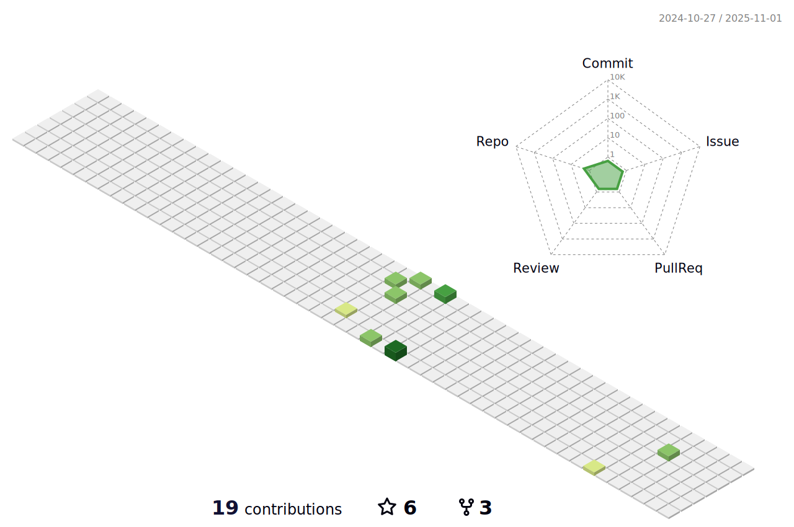

### Interest
I'm a frontend developer with backend experience.

Apart from being a web developer, I enjoy my time being outdoors. I like mountain biking and ice skating with my family.

When weather doesn't support outdoor activities I spend large amount of my free time exploring the latest technology advancements in the word of the front-end web development.

### Languages and Tools

### Find me around the web

---

---

